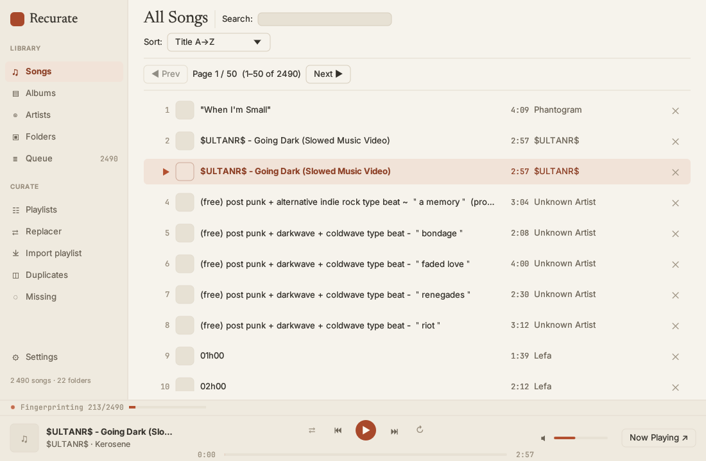
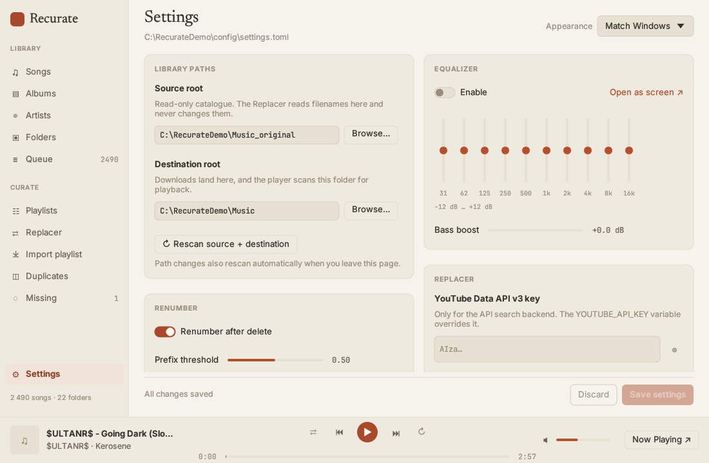
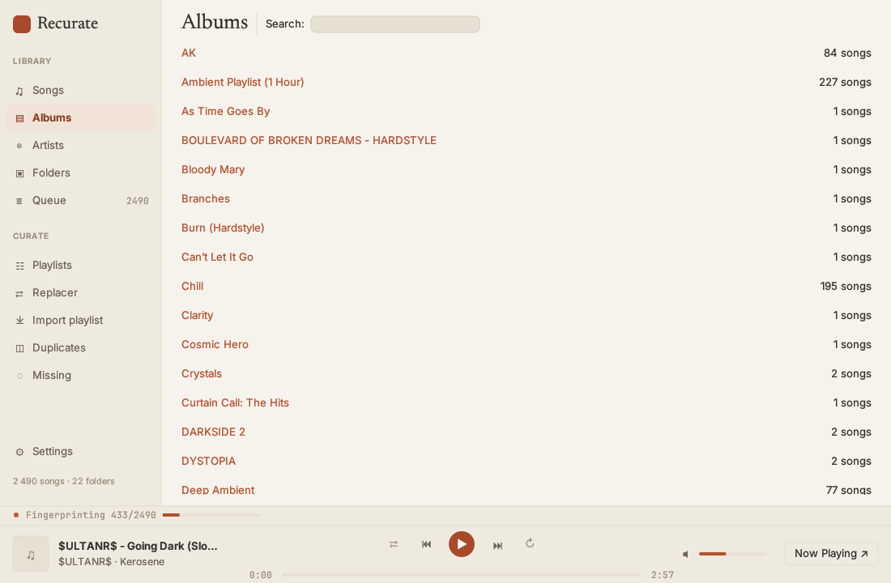
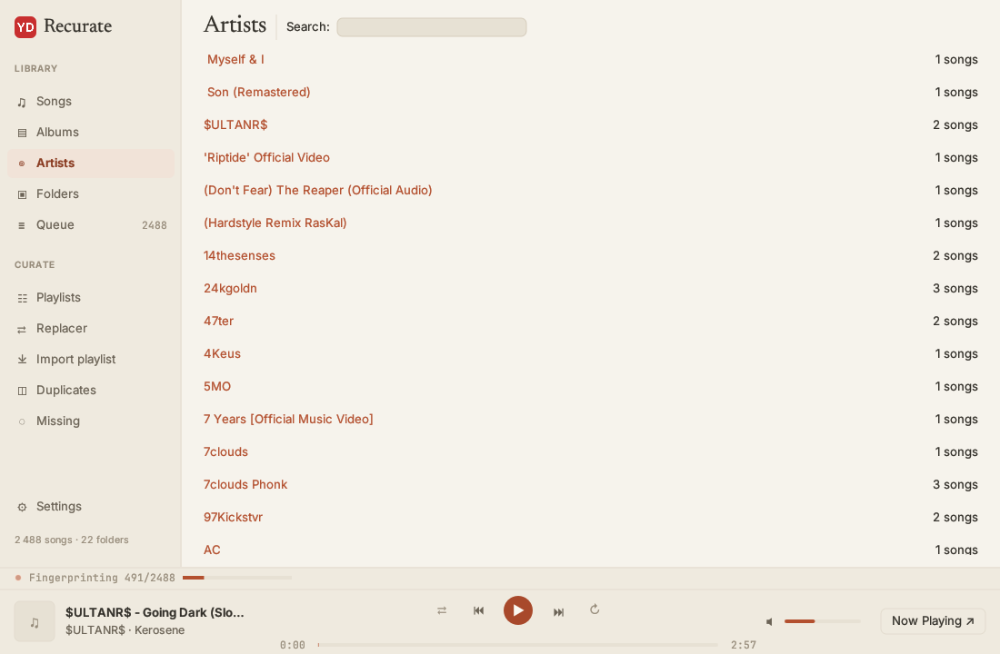
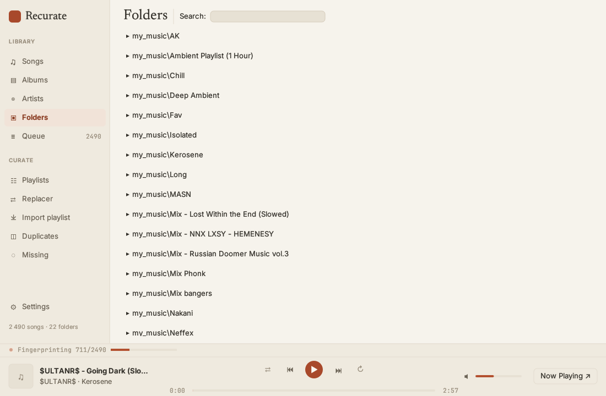
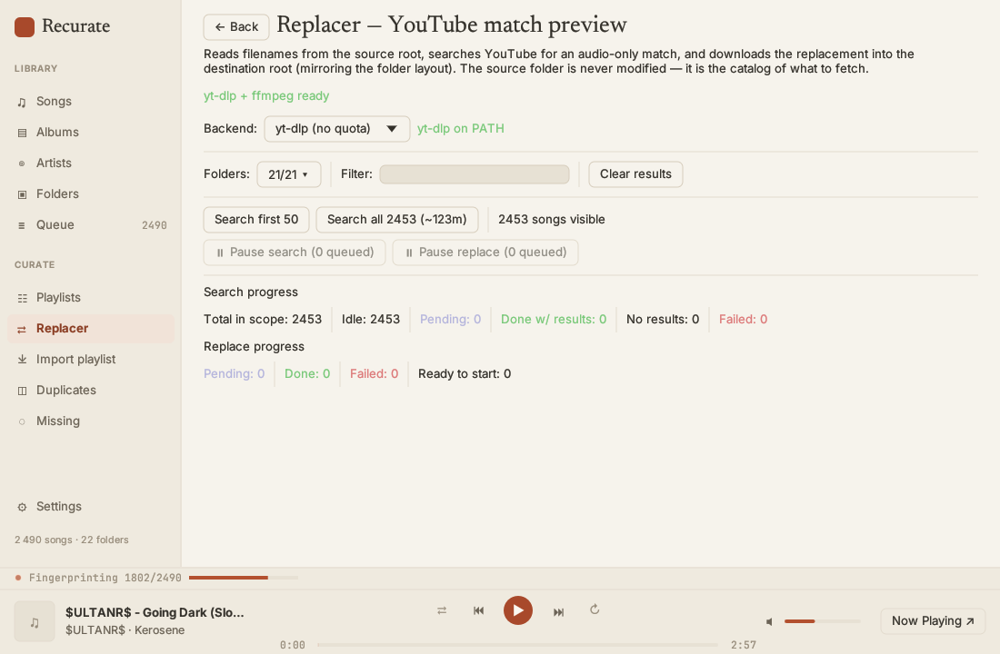
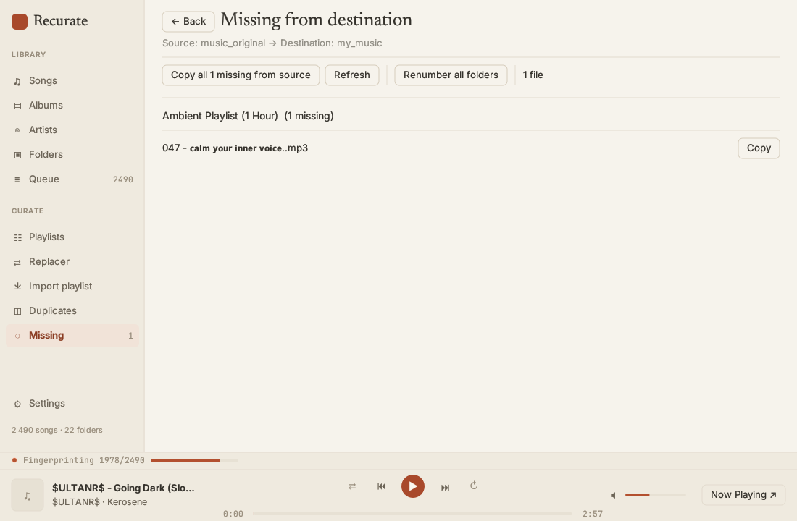
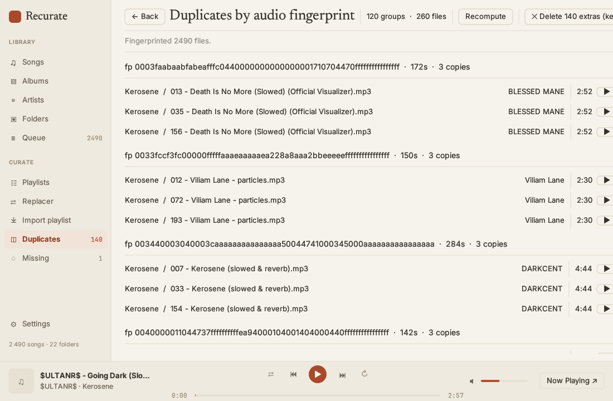

# Recurate

A native desktop music player for Windows that doubles as a YouTube replacement
pipeline: it walks your existing music library, finds the cleanest audio-only
upload of each track on YouTube, and atomically swaps your local files for the
fresh download — all in one app.



---

## Why this exists

If you have a curated `.mp3` library that grew over years from random
sources — Bandcamp rips, YouTube downloads, album torrents, AI-generated
tracks — you usually end up with:

- **Inconsistent quality.** Some files are 96 kbps Discord-grade, others
  are 320 kbps lossless conversions of the same song.
- **Music videos masquerading as audio.** A track downloaded from a music
  video has 30 seconds of intro animation noise, drops out for visualizer
  pauses, and ends with an outro card.
- **Broken filenames.** Full-width Unicode (`＂`, `｜`), stylized math
  Unicode (`𝒮𝓁𝑜𝓌𝑒𝒹`), `(free) type beat - "<title>"` boilerplate, prefix
  numbers that no longer match the album order.
- **Duplicates.** The same audio under three different filenames, or
  re-encoded copies that aren't byte-identical but are the same song.

This app fixes all of that in one place. Point it at your library, let it
search, score, download, replace, dedupe, and renumber.

---

## At a glance

| Component | Status | What it does |
|---|---|---|
| **Player** | working | Native egui player: scan, play, queue, EQ, delete, renumber. |
| **Replacer (embedded)** | working | YouTube search → audio-only filter → score → yt-dlp download → ID3 tag → atomic replace. Runs **inside** Recurate on its own screen. |

The dataset this is built for: **2,457 mp3 files across 22 flat folders**,
with naming patterns ranging from clean album tracks to bot-wall-defeating
yt-dlp Unicode escapes. If your library looks similar, the app will do the
right thing on it. If you have a 50,000-file library with deep nesting, file
an issue first — the design is calibrated for ~thousands, not tens of
thousands, and assumes flat folders.

---

## Quick start

### Prerequisites

- **Windows 11** (the app runs on Linux/macOS too, but font fallbacks and
  paths in this README target Windows).
- **Rust toolchain** (`rustup` from <https://rustup.rs>).
- **yt-dlp** on `PATH`. `winget install yt-dlp.yt-dlp`.
- **ffmpeg** on `PATH`. `winget install Gyan.FFmpeg`.
- A folder of `.mp3` files to point at.

The Replacer screen has a top-of-screen status pill that turns red/amber
when yt-dlp or ffmpeg is missing, so you'll know immediately if either
isn't installed.

### Build & run

```bash
cd player
cargo run --release
```

Default scan root is `<cwd>/music`, so launching from `player/` picks up
`player/music/`. Settings persist at
`%APPDATA%/Recurate/Recurate/settings.toml` after first save.

### Verify the build

```bash
cargo check --all-targets   # Type-check everything (lib + bin + tests)
cargo test                  # 50 tests across 5 suites
```

The test suites are pure unit / integration tests — they don't touch
your music library, the network, or yt-dlp. A clean run is the fastest
way to confirm a fresh checkout is healthy before pointing it at real
data.

### Two roots: source vs destination

The Replacer pipeline uses **two separate folder trees**:

- **Source root** (default `<cwd>/music_original`) — your read-only catalog.
  The Replacer reads filenames here to derive search queries. Files are
  never modified.
- **Destination root** (default `<cwd>/music`) — where downloaded /
  replaced files live. This is also the player's playback library.

When you replace a track, the new audio lands at
`dest_root/<same-folder>/<same-filename>` and the source is left alone.
This means **the source root *is* your backup** — if a download corrupts
something, the catalog is untouched.

Edit both paths in **Settings → Library paths**. Changing them auto-rescans
the moment you leave the Settings page.



---

## The screens

The top bar has buttons for every screen. Below is a tour with workflows.

### Songs


The flat list of every song in the destination library. Search by title /
artist / album, sort by various keys, paginate at 50 rows per page (the
library is too large to render all rows at once). Click anywhere on a
row — or use the per-row **▶** button — to start playback. The trailing
**✕** removes the file (renumbers the folder afterwards).

**Keyboard shortcuts that work everywhere:**

- `Space` — play / pause
- `Ctrl + →` — next track
- `Ctrl + ←` — previous track

(Shortcuts are suppressed while the search bar or any text field has
focus, so typing into the search box doesn't pause playback.)

### Albums / Artists / Folders

Three faceted views over the same library. Folders is the most useful
for this dataset since the library is organized by genre/source folder
rather than ID3 album metadata.





### Now Playing

The full-screen "what's playing" view with cover art, scrubber,
shuffle/repeat, and the queue.

### Queue

Reorderable upcoming-tracks list. Songs you delete from elsewhere are
auto-evicted here.

### Replacer

The headline feature. Read this section once before using it.



The Replacer enumerates the **source** root (not the destination), so
its song count reflects your catalog. The screen does not show a
per-song list — just aggregate counts and big action buttons.

**Workflow:**

1. Pick a search backend: **yt-dlp** (default, no quota, ~30 minutes for
   the whole library) or **YouTube Data API v3** (needs a key, capped at
   ~100 searches per day on the free tier — only useful for partial runs).
2. Tick which folders to include via the **Folders** popup. Untick the
   last folder to enter "select none" mode (no songs will be searched).
   Use **Reset to all** to undo.
3. Click **Search first 25** for a calibration run, or **Search all N**
   for a full pass. The button turns red and shows the API unit total
   if you're on the API backend with a large N.
4. As searches complete, **Start replace top match** appears. Click it to
   queue downloads for every song that has a top match. Re-click as more
   searches finish to pick up the new ones.
5. The yt-dlp pipeline downloads the chosen video, transcodes to mp3,
   embeds metadata + cover art, and atomically renames into the
   destination path. Failures leave the source untouched.

**Pause / resume:** each worker pool (search + download) has its own
pause button. Pause is non-destructive: queued items stay queued,
in-flight items finish.

**The bot wall.** YouTube sometimes returns
*"Sign in to confirm you're not a bot"* or `HTTP 403 Forbidden`. To get
past it:

- Open **Settings → Replacer**.
- Set **Cookies from browser** to `chrome`, `firefox`, `edge`, `brave`,
  or any name yt-dlp recognizes. Empty = off.
- **Close the browser before retrying.** Chrome and Edge lock their
  cookie database while running, so yt-dlp can't read the cookies until
  you exit.


The status pill at the top of the Replacer screen turns amber if
yt-dlp or ffmpeg is missing from `PATH`, and red if both are.

### Missing

Bootstrap helper for a fresh destination. Lists every source file whose
mirrored destination path doesn't exist yet, grouped by folder. One big
"Copy all" button copies everything via `std::fs::copy` — no YouTube,
no transcode. Use it once after pointing at a fresh destination, then
run the Replacer to upgrade individual tracks.



### Duplicates

Acoustic-fingerprint duplicate detection.



Songs are grouped by **(audio fingerprint, duration in seconds, parent
folder)**. The fingerprint is a 256-bit acoustic hash computed from two
30-second regions of the decoded PCM, so:

- Re-encodes of the same audio collide (different bytes, same hash).
- Different songs of the same length don't collide.
- Cross-folder same-audio copies are *not* flagged — keeping your
  Favorites folder mirroring origins is intentional.

Fingerprinting is **incremental**. The first visit to the screen kicks
off a background pass that fills the cache; subsequent visits are
instant. Deleting a duplicate doesn't re-fingerprint anything.

The **✕ Delete N extras (keep highest name)** button bulk-cleans
each group: sort filenames in descending order, keep the last (typically
the highest-numbered track), delete the rest. Two-click confirmation.
After deletion, each affected folder gets a single renumber pass so the
sequence stays contiguous.

### Settings


Library paths, renumber threshold, replacer backend, API key, cookies
browser. The API key is stored locally in `settings.toml`; a
`YOUTUBE_API_KEY` environment variable, if set, takes precedence and is
never persisted.

### Equalizer

10-band biquad EQ. (The chain is wired into the playback engine — the
EQ screen is the UI for tuning it.)

---

## Common workflows

### "I just got this app — how do I import my existing library?"

1. Build with `cargo run --release`.
2. **Settings → Library paths**:
   - Source root: where your existing files live, e.g. `D:/Music`.
   - Destination root: where the player will read from, e.g.
     `D:/Music_clean`.
3. Save and navigate away from Settings. Both roots auto-rescan.
4. Go to **Missing** and click **Copy all N missing from source**. This
   populates the destination with a copy of everything.
5. Songs now shows your full library. Play whatever.

### "I want to upgrade my Discord-grade rips to YouTube audio"

1. Confirm yt-dlp + ffmpeg are on `PATH` (Replacer status pill is green).
2. Open **Replacer**.
3. Tick the folders you want to upgrade (or leave all selected).
4. **Search first 25** as a calibration run. Watch the counts:
   *done with results* should match *idle → pending → done* over time.
5. If results look good, click **Search all N** for the rest.
6. As searches finish, click **Start replace top match** to download.
   Re-click periodically.
7. Tracks land in the destination atomically. Source files are never
   modified.

### "I deleted some files manually — fix the track numbers"

The renumber runs automatically after every delete from the app. If you
deleted files outside the app:

1. Adjust **Settings → Renumber → Threshold** if needed (default 50%
   of files in a folder must already have a `NN - ` prefix for the
   folder to be considered "numbered").
2. Trigger a renumber the next time the app touches the folder
   (delete a duplicate, replace a track, or use **Missing → Renumber
   all folders**).
3. Files without a number prefix will get one too — they slot in by
   alphabetical filename order, typically at the end of the sequence.

### "I have duplicates I didn't know about"

1. Open **Duplicates**. The first visit auto-fingerprints in the
   background — wait for the progress bar.
2. Review the groups. Each group shows `fp <hash> · <duration>s · N
   copies` with one row per file.
3. Per-row **✕ Delete** removes one file with confirmation in the
   toast.
4. Or click **✕ Delete N extras (keep highest name)** at the top to
   bulk-clean every group at once. The keeper is the
   lexicographically-largest filename per group.

### "YouTube is blocking my downloads"

The bot wall hits yt-dlp at random. To unblock:

1. **Settings → Replacer → Cookies from browser** = `chrome` (or
   whichever browser you're logged into YouTube with).
2. **Close that browser.** Chrome / Edge lock their cookie DB while
   running; yt-dlp can't read them.
3. Retry the search or download from the Replacer screen.

If it's still blocked: the cookies expired or the account isn't
logged in. Log into YouTube in the browser, close the browser, retry.

---

## Configuration

Settings live at `%APPDATA%/Recurate/Recurate/settings.toml`. Most edits
should go through the in-app Settings screen, but the file is
human-readable if you need to script changes:

```toml
[scan]
roots = ["C:/Users/you/Music"]
source_root = "C:/Users/you/Music_original"

[playback]
volume = 0.7

[renumber]
enabled = true
threshold = 0.5  # fraction of files in folder that need a NN- prefix

[replacer]
youtube_api_key = ""        # leave blank to use yt-dlp backend
cookies_browser = ""        # "chrome", "firefox", "edge"… empty = off
```

### Environment variables

| Variable | Purpose |
|---|---|
| `YOUTUBE_API_KEY` | Overrides `[replacer] youtube_api_key`. Highest precedence, never persisted. |
| `RUST_LOG` | Custom log filter. Default suppresses noisy `symphonia_bundle_mp3` warnings. Example: `RUST_LOG=debug cargo run --release`. |

---

## Keyboard shortcuts

| Key | Action |
|---|---|
| `Space` | Play / pause |
| `Ctrl + →` | Next track |
| `Ctrl + ←` | Previous track |

Shortcuts are gated on focus: typing into the search bar or any text
field never triggers them.

---

## Troubleshooting

**The Replacer status pill is amber/red.**
yt-dlp or ffmpeg isn't on `PATH`. Hover for which one. Install via
`winget install yt-dlp.yt-dlp` or `winget install Gyan.FFmpeg` and
restart the app (the probe is cached).

**"Sign in to confirm you're not a bot."**
Set **Cookies from browser** in Settings → Replacer, and **close that
browser** before retrying.

**Chinese / Cyrillic filenames render as boxes.**
The font fallback chain assumes Windows fonts at `C:\Windows\Fonts\`.
On Linux/macOS, edit `player/src/ui/fonts.rs` to point at your system's
CJK font.

**The Duplicates page says "0 groups" but I know I have duplicates.**
The first visit kicks off a background fingerprint pass. Wait for the
progress bar at the top. With ~2,500 files, the full pass takes a few
minutes on a typical machine.

**A delete failed silently.**
It didn't. The toast in the upper-right shows the failure with the
reason. The full path goes to the log if you want details.

---

## Project layout

```
Recurate/
├── README.md             # This file
├── .gitignore
├── docs/
│   └── screenshots/      # Images referenced from this README
└── player/               # The Rust crate (binary name: recurate)
    ├── Cargo.toml
    ├── src/
    │   ├── main.rs       # eframe entry point
    │   ├── lib.rs
    │   ├── data/         # Library, scanner, fingerprint, duplicates, tags
    │   ├── domain/       # Song, Screen, SortOption, PlaybackState
    │   ├── engine/       # symphonia decoder + cpal output + EQ
    │   ├── playback/     # PlaybackController, Queue, deletion
    │   ├── replacer/     # title cleaner, YouTube search, scoring,
    │   │                 # yt-dlp+ffmpeg download, search/download workers
    │   ├── ui/           # App, screens, components, toasts
    │   └── renumberer.rs # Track-number normalizer
    ├── tests/            # Integration tests (renumberer, library_dedup)
    ├── music/            # Destination root (gitignored)
    └── music_original/   # Source root, read-only catalog (gitignored)
```

For deeper architectural details — fingerprint algorithm history, the
two-root replace pipeline, why downloads use `--cookies-from-browser`,
why the Replacer screen has no per-song UI — read the doc comments in
the relevant modules (`data/fingerprint.rs`, `replacer/`, `ui/app.rs`).

---

## Adding screenshots

This README references images at `docs/screenshots/<name>.png`. To
populate them:

1. Run the app: `cd player && cargo run --release`.
2. For each entry in the table below, navigate to the screen and capture
   it with **Win + Shift + S** (Snipping Tool), then save with the
   exact filename.

| Filename | Capture |
|---|---|
| `songs.png` | The Songs screen with the library loaded. Search bar + at least 10 rows visible. |
| `albums.png` | Albums view with several album cards. |
| `artists.png` | Artists view with several artist cards. |
| `folders.png` | Folders view with several folder cards. |
| `replacer.png` | The Replacer screen mid-run — status pill, folder picker, and stat lines visible. |
| `missing.png` | The Missing page with at least one folder group expanded. |
| `duplicates.png` | The Duplicates page showing at least one duplicate group. |
| `settings.png` | The Settings screen, top of the page. |

Save into `docs/screenshots/`. The README will pick them up
automatically — Markdown viewers fall back to broken-image icons until
you do.

---

## License

(Project is private — no license file at this time.)
